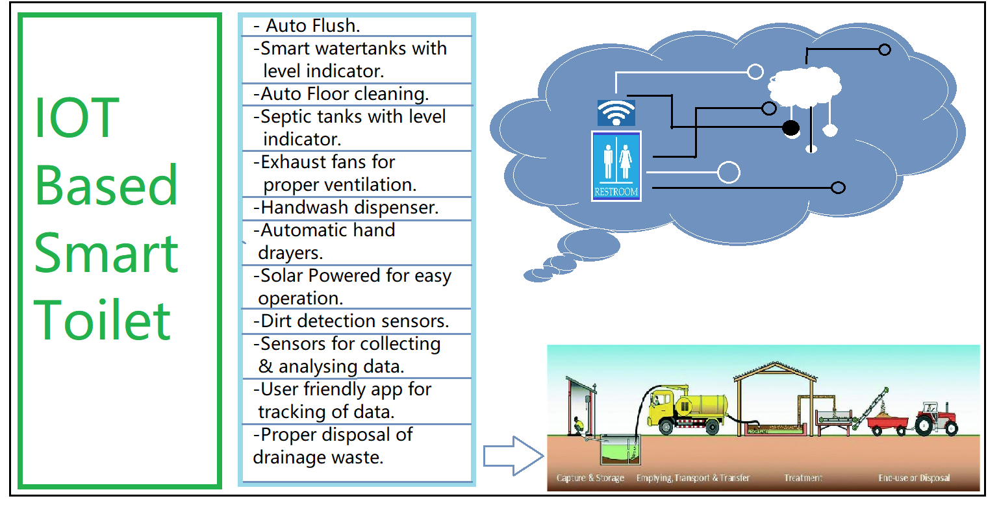
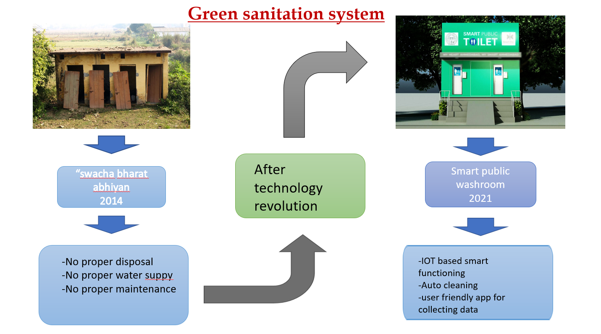

# Green Sanitition System

## Contents

- [Green Sanitition System](#green-sanitition-system)
  - [Contents](#contents)
  - [Short description](#short-description)
    - [What's the problem?](#whats-the-problem)
    - [How can technology help?](#how-can-technology-help)
    - [The idea](#the-idea)
  - [Demo video](#demo-video)
  - [The architecture](#the-architecture)
  - [Long description](#long-description)
  - [Project roadmap](#project-roadmap)
  - [Built with](#built-with)
  - [Contributors](#contributors)
  - [Acknowledgments](#acknowledgments)

## Short description

In our country, our government introduce the scheme called “Swatch Bharat” keeping toilet uncontainmented is one of the objective of clean India . In an existing system,
they are focused only on identifying the dart in toilets, observing the sweeper’s working . It can dodge many syndrome.

### What's the problem?

In our country specially in village area people do not have enough knowledge of using toilets. This leads to several diseases such as malaria, hepatitis, streptococcus, flu etc. to overcome all this problem we are implementing this
project.
### How can technology help?

In this project we are using the IoT based microcontrollers which is used for programmable input output, solar plates which is for power supply, LCD display for light emission, buzzer, IR sensors, Sonic sensors which are help in project for detecting the water level and many things. This type of smart toilets may be very helpful for old people, handicapped/disable person and small kids. This may also save water and energy.
### The idea

Considering the cleanliness in India our team &#39;innovation geek&#39; Implement the &quot;Green sanitization system&quot;. In which the sensor are imbedded for automatic
action. By using app we are controlling the services of all toilet. And also from the waste we are converting it into biogas and manure. All the idea is based on sensors and IOT and app is made with help of IBM cloud services.

## Demo video

## The architecture

## Long description

[More detail is available here](./docs/description.md)

## Project roadmap

## Built with

- [IBM Cloud Foundry](https://cloud.ibm.com/cloudfoundry/overview)
- [Internet of Things Platform](https://cloud.ibm.com/catalog/services/internet-of-things-platform)
- [Cloud Object Storage](https://cloud.ibm.com/objectstorage/create)

## Contributors

The following people have contributed to the concept/code:
- Prajakta Bharat Navtake
- Neeraj Navanath Raje
- Aishwarya Deshmane
- Jagruti Vilas Rane
- Tahir Ali
